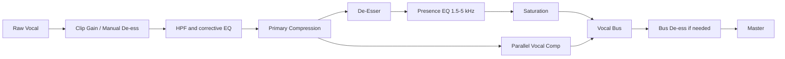
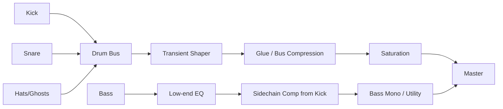

# Suno에서 타이트한 붐뱁 랩 트랙을 만드는 실전 보고서

> **출처**: GPT 딥리서치 (사용자 제공, 2026-04-25)
> **활용 목적**: 20-00 시리즈 Workout 컨셉의 보너스 빡센 붐뱁 1-2곡 슬롯 프롬프트 엔지니어링 자산
> **1162줄 §5 자산과 차이**: §5는 2024-2025 모던 (B-Free×Hukky/Owen/Huckleberry P), 본 자료는 90s-2000s 정통 + 한국 토착(가리온·데드피·제이호) + Suno 친화 프롬프트 6개 + Exclude 디테일

---

## 핵심 요약

이 보고서는 DAW, 예산, 숙련도가 지정되지 않았다는 전제에서, **Suno 안에서 “타이트한 붐뱁 랩”을 얻기 위한 프롬프트 설계**와 **실제 프로덕션·보컬·믹싱 관점의 체크포인트**를 한 묶음으로 정리한 것이다. 결론부터 말하면, Suno에서 타이트한 붐뱁을 만들 때 가장 중요한 건 “좋은 문장”이 아니라 **모델이 오해하지 않게 만드는 제약 설계**다. 즉, 스타일 필드에는 장르·질감·보컬 성격을 짧고 구조적으로 적고, 가사 박스에는 긴 연출 지시보다 **간결한 섹션·직접 가사**를 넣고, Exclude에는 sing-rap을 유도하는 요소를 분명히 빼야 한다. Suno 공식 문서도 Custom Mode, Instrumental, Exclude, Creative Sliders, Voices/Custom Models를 통해 입력 제약을 더 촘촘하게 걸 수 있다고 안내하며, 한국어 연구도 구조화된 프롬프트가 더 예측 가능한 결과를 낸다고 보고했다. citeturn22view1turn22view0turn24view0turn41search0turn46search12turn31view0

또 하나의 냉정한 결론은, **“소년스러운 얇은 드라이 랩 톤” 같은 미세한 보컬 캐릭터는 텍스트 프롬프트만으로는 한계가 크다**는 점이다. Suno 공식 기능 기준으로 가장 재현성이 높은 방법은 v5.5의 **Voices** 또는 **Custom Models**를 쓰는 것이다. Voices는 깨끗한 아카펠라와 높은 Audio Influence를 권장하고, Custom Models는 외부에서 만든 자신의 트랙을 업로드해 “자기 스타일 쪽”으로 모델을 기울이게 한다. 즉, 목소리 캐릭터가 핵심이면 프롬프트만 붙들고 기도하는 것보다, **보이스 레퍼런스를 제공하는 것이 훨씬 낫다**. AI에게 “좀 더 소년스럽게”를 8번 쓰는 것보다, 20초짜리 드라이 스포큰 레퍼런스 하나가 훨씬 덜 허망하다. citeturn41search0turn42search8turn46search12turn42search4

음향 제작 쪽에서는 붐뱁의 타이트함이 의외로 복잡한 문제가 아니다. 핵심은 **고정된 2바 루프, 적당한 스윙, 짧은 킥/스네어 엔벌로프, 과한 서브 지연 회피, 그리고 샘플의 멜로디 압력을 낮추는 것**이다. entity["company","Akai Professional","music hardware company"] MPC 계열 매뉴얼은 Timing Correct의 Note Value, Swing%, Shift Timing, Strength 파라미터로 스윙과 인간적 느슨함을 설계할 수 있다고 설명하고, entity["company","Ableton","music software company"] 매뉴얼과 entity["company","iZotope","audio software company"] 가이드는 킥을 트리거로 베이스를 덕킹하고, 저역을 모노로 정리하고, 트랜지언트 셰이핑으로 킥의 어택을 키우고 서스테인을 줄이면 저역 충돌과 늘어짐을 줄일 수 있다고 정리한다. citeturn33view2turn34search1turn11search0turn15view3turn13search0turn13search3

보컬은 “잘 부르는 것”보다 **안 부르는 것**이 더 중요하다. Suno 글로서리에서 rap은 “rhythmic spoken or chanted lyrics”로 안내되고, 사용자 메타태그 연구에선 verse/chorus/bridge 류 태그가 매우 흔하지만, **길고 복합적인 메타태그는 무시되거나 심지어 가사처럼 불려질 수 있음**이 관찰됐다. 그래서 타이트한 붐뱁 랩을 원하면 `[Verse]` 위주의 단순 구조, 평평한 억양, 짧고 단단한 자음, 지나친 훅 지시 제거가 더 안전하다. citeturn30view2turn21view0turn21view1

마스터링은 두 갈래로 생각하면 편하다. 플랫폼 친화적인 납품은 **대략 -14 LUFS / -1 dBTP 부근**이 안전하고, 실제 시장의 상업 곡은 훨씬 더 크다. 다만 2024년 글로벌 상위권 곡 평균은 약 **-8.3 LUFS**였고, 한편 Spotify는 재생 시 **-14 LUFS 기준**으로 정규화한다. 즉, 붐뱁 랩에서 punch를 지키고 싶다면 무조건 시장 평균을 따라 과압축할 이유는 없다. 장르 의도상 강한 마스터가 필요해도 -10~-8.5 LUFS 정도에서 드럼의 타격감이 죽지 않는지 먼저 듣고 결정하는 편이 낫다. citeturn17view0turn16search13turn17view1turn37search2

## Suno 프롬프트 엔지니어링

Suno 공식 문서상 Custom Mode는 **Lyrics / Style / Advanced Options / Instrumental**로 제어되고, v4.5 이후에는 Style Influence와 Weirdness로 스타일 고정력과 예측 불가성을 다시 조절할 수 있다. 또한 Suno 글로서리는 템포·구조·보컬 테크닉 용어를 프롬프트에 섞어 쓰라고 권하며, 연구 결과도 장르·악기·무드·템포·기법을 분명하게 구조화한 프롬프트가 더 예측 가능한 결과를 만든다고 보고한다. 즉, “좋은 감성의 붐뱁 랩”보다 **“장르 + 발성 + 리듬 + 배제할 것”**이 훨씬 잘 먹힌다. citeturn22view1turn24view0turn30view2turn31view0

### 프롬프트 설계 원칙

1. **Style 필드**에는 “장르/그루브/보컬/질감/금지할 멜로디 성향”을 적는다.  
2. **Lyrics 필드**에는 가사와 최소한의 구조만 둔다. 지시문을 장황하게 넣지 않는다.  
3. **Exclude 필드**에는 sing-rap, sung hook, melodic chorus, autotune, trap 808 같은 “원치 않는 것”을 분명히 쓴다.  
4. 가능하면 **Instrumental로 먼저 비트 성향을 잡고**, 보컬 캐릭터가 중요하면 나중에 Voices/Audio Upload/Custom Model로 밀어붙인다. Suno는 기본적으로 산출물을 단일 오디오 파일로 내보내기 때문에, 나중에 목소리만 부분 교정하는 건 귀찮고 비효율적이다. citeturn22view0turn22view1turn22view2turn46search0turn46search5

### 프롬프트 변형 비교

| 방식 | 언제 쓰나 | 예시 문구 | 장점 | 주요 실패 모드 |
|---|---|---|---|---|
| 최소형 스타일 프롬프트 | 빠른 탐색 | `tight boom bap, dry thin male rap, no singing` | 빠름 | 너무 일반적이라 trap/alt-rap로 샐 수 있음 |
| 구조화 스타일 프롬프트 | 가장 추천 | `tight boom bap, dry thin male spoken rap, unpitched, flat cadence, locked 2-bar loop, dusty drums, warm sampled bass, no singing, no sung hook` | 재현성 가장 좋음 | 과도하게 길면 일부 무시 가능 |
| 비트 우선 2패스 | 비트 질감이 핵심 | 1차 `instrumental` / 2차 voice or cover | 멜로디 보컬 유입을 차단 | 2차에서 보컬이 다시 멜로디화될 수 있음 |
| Voices / Custom Model 우선 | 보컬 캐릭터가 핵심 | 자체 음성 + 높은 Audio Influence | 텍스트보다 음색 고정력이 높음 | 레퍼런스 음질이 나쁘면 이상하게 고착됨 |

이 표의 핵심은 Suno가 **짧고 구조적인 스타일 설명**에는 잘 반응하지만, **길고 복합적인 메타태그**는 무시하거나 가사처럼 처리할 수 있다는 점이다. Voices와 Custom Models는 텍스트만으로 해결되지 않는 음색 문제를 해결하는 공식 경로다. citeturn21view0turn24view0turn41search0turn46search12

### 보컬 캐릭터 키워드 비교

아래 키워드는 **공식 통제 어휘가 아니라 경험적 지시어**다. Suno 공식 문서는 “style descriptors”를 넣으라고만 하고, 특정 형용사가 고정된 결과를 보장한다고 약속하지 않는다. 따라서 이 표는 **실전용 heuristic**로 봐야 한다. 그래도 structured prompt가 예측 가능성을 올린다는 점은 공식 문서와 연구가 뒷받침한다. citeturn41search0turn31view0

| 목표 톤 | 1차 키워드 | 2차 대체 키워드 | 피해야 할 키워드 | 코멘트 |
|---|---|---|---|---|
| 10대/비강성 | `teen male`, `nasal`, `lightweight`, `youthful` | `boyish`, `thin tone` | `husky`, `gritty`, `raspy`, `baritone` | 지나치면 장난감 같은 톤이 나올 수 있음 |
| 드라이·얇음 | `dry thin male rap`, `dry voice`, `light male vocal` | `paper-thin`, `lean tone` | `lush`, `wet`, `wide`, `reverb-heavy` | 가장 안정적인 조합 |
| 가볍고 비비지 않음 | `non-raspy`, `clean spoken rap`, `flat cadence` | `plain delivery`, `neutral rap tone` | `soulful`, `melodic`, `crooning`, `harmonized` | sing-rap 억제에 유리 |
| 느슨하지만 빡셈 | `lazy pocket`, `laid-back`, `hard articulation` | `cool-headed`, `sleepy but sharp` | `emotional`, `anthemic`, `uplifting` | “게으른데 빡센” 상충 지시는 둘 다 필요 |

### Exclude 키워드 추천

Suno는 Advanced Options의 Exclude에 **원하지 않는 악기, 보컬, 스타일 요소를 직접 적는 공식 기능**을 제공한다. 그래서 “금지 목록”은 옵션이 아니라 거의 필수다. citeturn22view0

| Exclude 키워드 | 기대 효과 | 비고 |
|---|---|---|
| `singing, sung vocals, sung hook` | 후렴 멜로디 억제 | 가장 우선 |
| `melodic rap, sing-rap, crooning` | 랩-멜로디 혼합 억제 | 드레이크화 방지용 |
| `autotune, harmony vocals, choir` | 광택성/코러스성 억제 | 팝화 방지 |
| `anthemic chorus, emotional chorus` | 후렴 대합창화 방지 | hook 과장 억제 |
| `808, trap hats, trap snare` | trap 이동 억제 | 경험적이지만 효과 큼 |
| `beat switch, fills, risers, EDM FX` | 구조 일탈 억제 | 루프 고정에 도움 |
| `arpeggio, synth lead, glossy synth` | 멜로디 압력 완화 | 랩 중심 유지 |

### 정확한 프롬프트 문장 예시

아래 예시는 **Suno에 바로 넣는 형태**로 다듬은 문장이다. 스타일 필드와 Exclude를 분리하는 방식을 기본으로 했다. 구조 태그는 최소화했다. Suno 글로서리와 메타태그 연구가 보여주듯, 구조 태그는 필요하지만 남용하면 오히려 노래해 버릴 수 있다. citeturn30view2turn21view0

**스타일 필드 예시 A**  
> Korean tight boom bap, dry thin male spoken rap, unpitched, flat cadence, sharp articulation, locked 2-bar MPC swing groove, dusty kick and snare, warm sampled bassline, sparse chopped soul texture, no singing

**스타일 필드 예시 B**  
> Hard lazy boom bap rap, lightweight non-raspy male voice, spoken not sung, narrow dry vocal, punchy drums, minimal loop, no hook lift

**Exclude 예시**  
> singing, sung hook, melodic rap, crooning, autotune, harmony vocals, choir, 808, trap hats, beat switch, risers, EDM FX, arpeggio

### 가사 템플릿

이건 중요한데, **후렴을 굳이 후렴처럼 쓰지 않는 것**이 좋다. “Hook”를 써도 되지만, sing-rap이 너무 자주 붙으면 `[Refrain]`보다 그냥 같은 박자감의 후렴성 텍스트를 `Verse`로 계속 밀어붙이는 편이 낫다. 연구상 verse/chorus 계열 메타태그는 매우 흔하지만, 긴 지시가 섞이면 모델이 들쭉날쭉하게 반응할 수 있다. citeturn21view0

> [Verse 1]  
> 8–16 bars, same cadence, no melodic stretch  
>   
> [Verse 2]  
> 8–16 bars, continuation, no sung hook  
>   
> [Verse 3]  
> 8–16 bars, denser multisyllabic rhymes  
>   
> [Outro]  
> 2–4 bars, spoken finish

## 드럼, 베이스, 샘플링 설계

붐뱁을 붐뱁처럼 들리게 만드는 건 사실 “샘플 많이 쓴다”가 아니라 **드럼이 제멋대로 흔들리지 않게 관리하는 것**이다. entity["company","Native Instruments","music software company"] Native Instruments의 붐뱁/재즈랩 튜토리얼은 93 BPM, 81 BPM 같은 느긋한 템포에서 8비트 하이햇, 2·4 스네어, 2바 루프, 스윙된 보조햇/고스트 스네어, 공간이 남는 심플한 배치를 제시한다. 반면 entity["company","Akai Professional","music hardware company"] 매뉴얼은 1/16 note timing correct, Swing%, Shift Timing, Strength, Note Repeat를 통해 그런 인간적인 뒤틀림을 정밀하게 만들 수 있다고 설명한다. citeturn8view0turn10view0turn33view2

### 드럼 프로그래밍

- **루프 길이**: 2바 고정 루프를 기본으로 잡고, variation은 킥 1~2개와 ghost snare 정도만 준다. Native Instruments 예제도 단일 바에서 출발해 2바 변형으로 확장한다. citeturn8view0  
- **퀀타이즈**: 1/16 기준으로 두고, Strength를 100%로 고정하기보다 살짝 낮춰 인간적인 흔들림을 남긴다. Akai 문서는 Strength가 낮을수록 원 퍼포먼스의 “human feel”을 더 유지한다고 명시한다. citeturn33view2  
- **스윙**: Swing%와 Shift Timing은 hi-hat, ghost snare, 보조 킥에 집중해 적용한다. MusicRadar가 정리한 entity["musical_artist","J Dilla","hip hop producer"] 관련 기사도 그의 리듬이 off-grid와 개별 스윙 조절에서 나온다고 설명한다. 너무 많이 흔들면 힙해지는 게 아니라 그냥 취기가 올라온다. citeturn33view2turn38search0  
- **킥/스네어 튜닝과 EQ 출발점**: 킥은 60–80 Hz의 펀치, 200–500 Hz의 박스감 정리, 1–5 kHz의 어택이 출발점이고, 스네어는 150–250 Hz body와 2–3.5 kHz snap이 핵심이다. citeturn29search1  
- **트랜지언트 셰이핑**: 드럼을 더 빡세게 하고 싶으면 압축부터 거는 게 아니라 **어택 증가 + 서스테인 감소**로 킥/스네어 길이를 줄여라. iZotope는 이 방식이 드럼브레이크와 킥을 더 펀치 있게 만든다고 설명한다. citeturn13search0turn15view3

### 베이스와 저역

붐뱁에서 808은 “절대 금지”가 아니라 **목표 사운드를 흐리는 경우가 많다**는 게 실전 결론이다. 특히 Suno 프롬프트에 `808`을 넣으면 모델이 트랩 계열 서브와 하이햇 패턴 쪽으로 이동하는 일이 잦다. 이건 공식 룰은 아니지만, Suno가 스타일·장르 지시를 강하게 반영하고 Exclude도 공식 지원하므로, 원하는 것이 warm sampled boom bap 저역이라면 아예 `warm sampled bassline`, `upright bass one-shot`, `short sustain sub-bass`처럼 써주는 편이 낫다. 구조화된 프롬프트가 결과를 더 예측 가능하게 만든다는 연구도 같은 방향을 뒷받침한다. citeturn22view0turn24view0turn31view0

실제 믹스에선 **킥이 베이스를 누르는 구조**가 기본이다. iZotope는 짧고 펀치 있는 킥이 지속음 성격의 베이스를 잠깐 밀어내게 하는 것이 더 적절하다고 설명하고, Ableton 매뉴얼도 킥을 외부 사이드체인으로 써서 베이스의 저역 충돌을 제어하라고 안내한다. 저역 스테레오 이미지는 가급적 모노화하고, Ableton Utility의 Bass Mono는 50–500 Hz 범위를 모노로 정리할 수 있다. citeturn15view3turn34search1turn11search0

### 샘플링과 어레인지

붐뱁 샘플링은 여전히 “루프 + 쪼개기 + 재배열”의 세계다. entity["company","Tracklib","music sampling platform"] 가이드는 드럼 브레이크가 본래 멜로디 요소 없이 코어 퍼커션만 남는 구간이며, 이후 힙합 프로듀서들이 킥/스네어/하이햇을 잘라 자기 패턴으로 재조합하는 방향으로 진화했다고 설명한다. 또 Music Sampling Guide는 템포 변경, time-stretch, pitch shift, layering이 기본 테크닉이라고 정리한다. citeturn40view2turn40view1

Suno 관점에서 중요한 추가 포인트는 **샘플이 너무 노래를 강요하지 않게 만드는 것**이다. 멜로디가 지나치게 선명한 보컬 샘플, 후렴성 화성 패드, “감정이 이미 완성된” 소울 훅은 AI가 거기에 맞춰 노래를 붙일 확률을 올린다. 그래서 다음 순서가 안전하다.

- 보컬 샘플보다 **짧은 악기 조각**을 우선 쓴다.  
- 필요하면 **low-pass / bitcrush / pitch shift**로 선명도를 낮춘다. Native Instruments 예제는 12-bit / 6–8 kHz 수준의 크러시와 low-pass로 빈티지 질감을 만들고, 보컬이 들어갈 공간을 남긴 단순 어레인지를 권한다. citeturn9view0turn10view0  
- 후렴에서 샘플을 더 세게 여는 대신, **다른 스탭이나 다른 베이스 노트**로 작은 대비만 준다. Native Instruments의 붐뱁 예제 자체도 “plenty of room for vocals”를 강조한다. citeturn9view0  

## 보컬 녹음과 딜리버리

Suno에서 타이트한 붐뱁 랩을 원한다면, 보컬 파트는 “랩을 얼마나 잘하느냐”보다 **멜로디를 얼마나 잘 봉쇄하느냐**가 더 중요하다. Suno 글로서리는 rapping을 “rhythmic spoken or chanted lyrics”로 정의하고 있고, Voices는 깨끗한 아카펠라, 좋은 마이크, 음향적으로 중립적인 환경을 권한다. 즉, Suno 쪽에서도 사실상 “말하듯 또렷하게 들어간 음성”이 기준점이다. citeturn30view2turn41search0

### 마이크와 거리

entity["company","RØDE","microphone company"] 공식 가이드는 대부분의 마이크에서 **입과 6–10 cm 거리**, 팝필터는 **마이크에서 약 5 cm**, 그리고 캡슐 정면이 아니라 **약간 비스듬히 말하는 것**을 권한다. NT-USB Mini 가이드는 speech/voiceover에서 **10–15 cm**를 추천하며, 가까울수록 voice-to-background-noise ratio가 좋아진다고 설명한다. untreated room이라면 가까이, 드라이하게, 작게 잡는 쪽이 유리하다. citeturn25view1turn25view3turn25view2

### sing-rap을 피하는 딜리버리 코칭

1. **피치 센터를 만들지 말 것**  
   음끝을 위나 아래로 길게 끌지 말고, 문장 종결을 짧게 닫는다. “음가를 늘리며 감정 준다”는 버릇은 AI에게 “노래해도 되네?”라는 잘못된 용기를 준다.  
2. **자음은 세게, 모음은 짧게**  
   보컬 intelligibility는 대체로 1.5–5 kHz에서, sibilance는 5–8 kHz에서 두드러진다. 즉, 또렷한 자음은 중요하지만 “s / sh / ch / t”가 과해지면 날카로워진다. 녹음 단계에서는 똑똑하게 발음하고, 과한 치찰음은 나중에 de-esser로 잡는 편이 낫다. citeturn29search0turn15view2  
3. **호흡은 라인 끝이 아니라 라인 사이에서**  
   긴 문장을 한 번에 밀다 보면 끝에서 음정이 뜨거나 힘이 빠지기 쉽다. 2–4 bar 단위로 호흡 지점을 미리 정해두면 cadence가 평평하게 유지된다. 이 부분은 녹음 기술보다 퍼포먼스 설계의 문제다.  
4. **“flat cadence + hard articulation”를 같이 써라**  
   flat만 쓰면 처지고, hard만 쓰면 shout가 된다. 둘을 같이 지시해야 “나른한데 선명한” 결과가 더 잘 나온다.  
5. **모니터링은 반드시 헤드폰**  
   RØDE는 플로시브와 마이크 적응을 위해 헤드폰으로 자신을 들으며 연습하라고 권한다. 이게 제일 값싼 보컬 코치다. 자존심은 좀 상해도 효과는 좋다. citeturn25view2

### 멀티실래빅 라임 포켓

이건 Suno보다 래퍼 문제인데, AI든 사람이든 붐뱁에서 귀가 꽂히는 건 **강세 설계**다. 문장을 전부 빽빽하게 때려넣으면 타이트해지는 게 아니라 그냥 숨이 찬다. 2-bar 단위로 보면:

- 1 bar: 정보 전달
- 2 bar: 라임 압축
- 3 bar: 미세한 휴지와 어택
- 4 bar: 펀치라인

이 패턴을 가사에 넣으면 Suno 가사 해석도 덜 흐트러진다. 공식 문헌이 이걸 직접 말해주진 않지만, 구조적 프롬프트가 예측성을 올린다는 연구 결과와 잘 맞는다. citeturn31view0

## 믹싱, 마스터링, 검수

### 추천 라우팅

아래 체인은 DAW-agnostic 기준이다. 예시는 entity["company","Ableton","music software company"] / entity["company","iZotope","audio software company"] 논리를 섞어 만들었다. 저역 모노화, 킥→베이스 사이드체인, 병렬 압축, 보컬 de-ess / presence 관리가 핵심이다. citeturn34search1turn11search0turn15view2turn36search4turn37search2

### 드럼/보컬 믹싱 핵심

**드럼 버스**  
트랜지언트 셰이퍼로 어택을 올리고 서스테인을 줄인 뒤, 필요할 때만 버스 압축을 더한다. iZotope는 transient shaping이 킥의 어택을 강조하고 resonance를 줄여 low-end를 더 타이트하게 만든다고 설명한다. 병렬 압축은 드럼의 공격감과 방의 밀도를 올리는 데 유효하다. citeturn15view3turn36search4turn36search14

**보컬 체인**  
- 정리 EQ: 불필요한 저역을 잘라 mud를 치운다.  
- 압축: 너무 빠른 attack은 펀치를 죽이므로 피하고, 필요하면 2단 압축으로 나눠 제어한다.  
- de-ess: 4–10 kHz를 기본으로 보되, 마이크/성향에 따라 더 낮은 대역까지 문제일 수 있다.  
- presence: 1.5–5 kHz를 조금만 만진다. 여기 를 많이 건드리면 랩이 선명해지는 게 아니라 얄미로워진다. citeturn15view0turn15view2turn29search0turn36search16turn36search11

### 마스터링과 최종 검수

플랫폼 기준으로는 Spotify가 **-14 LUFS** 정규화를 적용한다. iZotope의 스트리밍 가이드도 **대략 -14 LUFS / -1 dBTP**를 안전한 공통 분모로 제시한다. 반면 2024년 글로벌 상위권 곡 평균은 **-8.3 LUFS**였고, 이는 상업적인 경쟁 레벨이 여전히 상당히 크다는 뜻이다. 그러나 iZotope의 마스터링 가이드와 분석은 True Peak 제한이 트랜지언트를 부드럽게 만들 수 있고, 과한 리미팅은 보컬 펌핑과 질감 손실을 초래할 수 있다고 짚는다. 그래서 실무적으로는 다음 두 갈래가 좋다. citeturn16search13turn17view1turn17view0turn37search2turn37search4

- **Streaming-safe master**: 약 -14 LUFS / -1 dBTP  
- **Competitive ref master**: 대략 -10~-8.5 LUFS / -1~-0.3 dBFS 또는 dBTP 범위에서 드럼 펀치가 살아있을 때까지

검수 체크는 최소한 이 다섯 가지다.  
1. 저역이 mono 합성에서 무너지지 않는가  
2. 킥 첫 어택이 베이스에 묻히지 않는가  
3. 보컬 치찰음이 이어폰에서 찌르지 않는가  
4. 후렴으로 갈수록 sing-rap이 새지 않는가  
5. 리미터 전/후에 랩의 자음 선명도가 죽지 않는가  
citeturn11search0turn34search1turn15view2turn37search2

### 세션 셋업 체크리스트

1. BPM과 2-bar loop 먼저 고정  
2. 킥/스네어 샘플 길이부터 확인  
3. 베이스는 808 대신 warm sampled bass로 시작  
4. Style 필드는 2줄 이내로 압축  
5. Lyrics 박스에는 긴 연출 지시 금지  
6. Exclude에 singing/808/trap/EDM 계열 먼저 입력  
7. Weirdness는 50% 이하에서 시작, Style Influence는 Strong 쪽  
8. untreated room이면 마이크 6–15 cm, 팝필터 사용  
9. 헤드폰으로 plosive/sibilance 체크  
10. master는 -14 LUFS용 / competitive용 두 버전 확인  
citeturn24view0turn22view0turn25view1turn25view3turn17view1turn16search13

## 트러블슈팅, 템플릿, 레퍼런스

### 왜 Suno는 자꾸 노래를 하나

가장 흔한 원인은 네 가지다.

첫째, **구조 태그가 너무 “노래형”**이다. chorus, pre-chorus, hook를 넣고, 가사까지 길게 쓰면 모델은 당연히 노래를 부르기 쉽다. Suno 관련 대규모 연구에서도 verse/chorus류 메타태그가 지배적이었고, 긴 지시열은 무시되거나 가사처럼 불려질 수 있다고 나왔다. citeturn21view0

둘째, **스타일 프롬프트가 멜로디를 유도**한다. `soulful`, `anthemic`, `emotional chorus`, `harmonized` 같은 단어는 sing-rap에 우호적이다. 반대로 Suno 글로서리에 있는 `rapping`, `sparse`, `groove`, `sampling`, `distortion`, `compression` 같은 생산적 단어를 늘리고, 노래를 암시하는 단어를 줄여야 한다. citeturn30view2

셋째, **Weirdness가 높고 Style Influence가 약하다.** 공식 문서상 Weirdness는 Safe~Chaos, Style Influence는 Loose~Strong다. 타이트한 붐뱁 랩은 예술가병보다는 강한 통제가 낫다. 이번만큼은 자유를 조금 포기해도 된다. 자유를 사랑한다면, 적어도 후렴에서만 사랑하자. citeturn24view0

넷째, **음색을 텍스트로만 억지 조작하려고 한다.** 정말 특정한 통성, 나이감, 얇기, 비강성을 원하면 Voices나 Custom Model이 더 낫다. Voice가 자기 목소리처럼 안 들리면 Audio Influence를 올리라고 Suno가 직접 말한다. citeturn41search0turn42search8turn46search12

### 실전 수정 레시피

| 문제 | 바로 할 수정 |
|---|---|
| 후렴에서 자꾸 노래함 | `chorus`, `hook`, `pre-chorus` 제거 후 `Verse 2`, `Verse 3`로 재시도 |
| 목소리가 너무 굵고 쉼 | `dry thin male rap, lightweight non-raspy, youthful` 추가, `husky, raspy, baritone` 제외 |
| trap으로 샘 | `808, trap hats, trap snare` Exclude, 샘플드 베이스·dusty drums 명시 |
| 루프가 자꾸 바뀜 | `locked 2-bar loop, no fills, no beat switch` 추가 |
| 보컬이 비강성만 있고 랩이 약함 | `flat cadence`만 두지 말고 `hard articulation, sharp consonants` 병기 |
| 여전히 안 맞음 | Voices 또는 Audio Upload로 직접 스포큰 레퍼런스 제공 |

### 최종 추천 Suno 프롬프트 6개

이 6개는 **한국어 중심 최종 추천본**이다. 상황별로 바로 복붙해서 쓸 수 있게 짧게 작성했다. Suno 공식 문서의 Custom / Exclude / Voices / Creative Sliders 논리를 따라 만든 템플릿이다. citeturn22view1turn22view0turn24view0turn41search0

**프롬프트 1**  
> Korean tight boom bap, dry thin male spoken rap, unpitched, flat cadence, hard articulation, locked 2-bar MPC swing groove, punchy kick, dusty snare, warm sampled bass, sparse chopped soul texture, no singing

**프롬프트 2**  
> Korean hard lazy boom bap rap, lightweight non-raspy male voice, narrow dry vocal, spoken not sung, sharp consonants, minimal loop, dusty vinyl texture, no hook lift

**프롬프트 3**  
> Korean underground boom bap, teenage-nasal thin rap tone, dry close-mic voice, monotone delivery, chopped jazz sample, tight kick and snare, no melodic chorus

**프롬프트 4**  
> Korean grimy 90s boom bap, dry boyish male rap, flat pitch, dense multisyllabic flow, locked drum pattern, warm bass one-shots, low-pass soul chops, no singing

**프롬프트 5**  
> Korean minimal boom bap cypher beat with dry thin spoken rap, punchy drums, short sustain kick, roomless vocal, narrow stereo, no chorus melody

**프롬프트 6**  
> Korean dusty jazz boom bap, laid-back pocket but hard rap articulation, lightweight male voice, spoken cadence, simple arrangement with room for bars, no sing-rap

### 짧은 영어 fallback 6개

**Fallback 1**  
> Tight boom bap, dry thin male spoken rap, no singing, locked 2-bar loop

**Fallback 2**  
> Hard lazy boom bap, lightweight non-raspy male rap, flat cadence, no sung hook

**Fallback 3**  
> Dusty 90s boom bap, boyish dry rap voice, punchy drums, no melodic chorus

**Fallback 4**  
> Underground boom bap, teenage-nasal thin rap tone, spoken not sung, minimal loop

**Fallback 5**  
> Jazz boom bap, narrow dry vocal, sharp articulation, warm sampled bass, no sing-rap

**Fallback 6**  
> Grimy boom bap cypher, monotone male spoken rap, dusty drums, no 808, no beat switch

### 레퍼런스 트랙과 합법적 stem 소스

상업 음원의 “공식 stems”는 생각보다 잘 안 풀린다. 그래서 실전적으로는 **공식 instrumental 버전**이나 **라이선스된 multitrack 플랫폼**, 혹은 Suno/DAW의 stem extraction을 조합하는 편이 낫다. Suno는 Stem Extraction, Studio multitrack export, Voice/Audio Upload를 공식 지원한다. citeturn46search0turn46search2turn46search5turn46search11

| 목적 | 추천 레퍼런스 | 왜 듣나 | 합법적 연습 소스 |
|---|---|---|---|
| 클래식 샘플 붐뱁 | entity["song","They Reminisce Over You (T.R.O.Y.)","1992 hip hop single"] by entity["musical_artist","Pete Rock & CL Smooth","hip hop duo"] | 2-bar sample 중심, smooth bass, East Coast 붐뱁 감각 | licensed sample/multitrack on Tracklib citeturn8view0turn19search7 |
| Dilla식 미세한 뒤틀림 | entity["song","Runnin'","The Pharcyde song"] produced by entity["musical_artist","J Dilla","hip hop producer"] | off-grid pocket, swing 감각 | timing study + manual emulation citeturn38search0turn33view2 |
| 재즈랩 공간감 | entity["song","Check the Rhime","A Tribe Called Quest song"] by entity["musical_artist","A Tribe Called Quest","hip hop group"] | 재즈 샘플 + 보컬 공간 배치 | short chopped melodic samples citeturn10view0 |
| 현대 랩 마스터 레퍼런스 | entity["song","Not Like Us","Kendrick Lamar song"] by entity["musical_artist","Kendrick Lamar","rapper"] | 현대적 라우드니스와 드럼 punch | loudness/TP benchmark only citeturn37search1 |
| 한국어 붐뱁 딕션 | entity["musical_artist","가리온","korean hip hop duo"] – entity["song","무투(武鬪)","Garion single"] / `금기어` | 한국어 랩의 질감, 어둡고 묵직한 비트, 힘 뺀 랩 스타일 | 공식 instrumental release 존재 citeturn44search7turn44search9turn44search6 |
| 한국형 올드스쿨 붐뱁 | entity["musical_artist","데드피","korean rapper"] – `Check My Swag` | 90s hardcore/old-school boom bap, vintage EP 텍스처 | 공식 `Check My Swag (Inst.)` 존재 citeturn45view0 |
| 느슨한 위스퍼 톤 로컬 참조 | entity["musical_artist","제이호","korean rapper"] – `LOCALS ONLY` | 위스퍼 톤, 여유로운 플로우, 로컬 딕션 감각 | 공식 stem은 불명확, 레퍼런스 청취용 citeturn43search2 |
| 합법적 multitrack 연습 | Tracklib multitracks / Cambridge MT library | 드럼·베이스·기타를 분리 연습 | 라이선스 또는 교육용 multitrack citeturn40view2turn18search0 |

### Open questions / limitations

이 보고서에서 **보컬 형용사 키워드**(`boyish`, `thin`, `nasal`, `non-raspy`)는 공식 통제 어휘가 아니라 **경험적 프롬프트 문법**이다. Suno 공식 문서는 style descriptors와 Voices/Custom Models의 존재를 설명하지만, 특정 형용사와 특정 음색을 일대일 대응시키진 않는다. 또한 상업 음원의 **공식 stems 공개는 제한적**이라, 실제 연습에서는 공식 instrumental, Tracklib 같은 라이선스 플랫폼, Suno/a DAW의 stem extraction을 병행하는 쪽이 현실적이다. 마지막으로 Suno 버전별 반응은 변할 수 있으니, Reuse Prompt로 한 변수씩 바꾸며 저장·비교하는 게 가장 안전하다. citeturn41search0turn46search12turn46search0turn42search6